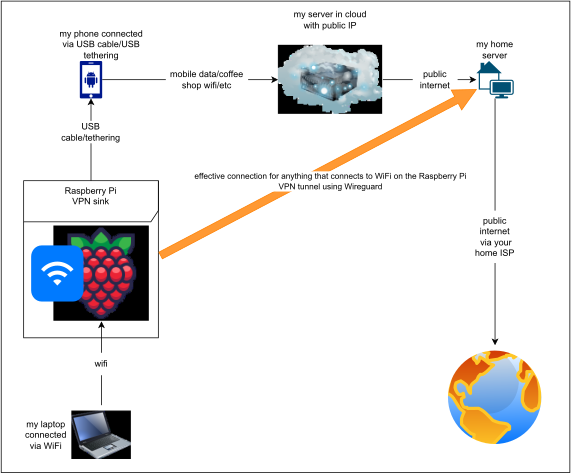

# WFH-Anywhere

## What is this for?

This repo contains BASH tool that will help you configure a Wireguard VPN tunnel running via any\* number of hops/nodes.

The script will guide you via configuration stage and will produce all-in-one, stand alone installation script that you can then copy to each of your nodes, execute and voila!

## TL;DR; aka Quick start

Assumptions:

- you've got a Raspberry Pi 4, when I say Raspberry Pi I mean that specific one
- you run Ubuntu server 22.04 on the aforementioned Raspberry Pi. Ubuntu Desktop at same version and other relatively new versions should also work but no guarantees given.
- you have Android based phone from which you can tether your internet connection via USB cable (tested with Google Pixel 7 and OnePlus 5).

1. Install Ubuntu Server 22.04 on your Raspberry Pi 4 microSD card,
2. Run the ./run_me.sh script directly on your machine. It will install a couple of packages if these are yet not there but it will not make any changes to your system, only generate installation scripts that then you copy and run on machines these are intended for. If you prefer something even safer and you have Docker installed you can run something like this:
   `docker run -it --rm --privileged -v $(pwd):/root/WFH-Anywhere/ -w /root/WFH-Anywhere/ docker.io/library/ubuntu:jammy bash`
   and then run the `./run_me.sh` script.
3. Follow the script entering requested answers or accepting defaults if offered.
4. There will be a new directory created called `./output`. Directories inside of it with names like `1`, `2`, `3`, etc. are nodes through which you decide to relay your VPN connection. In each of these numbered directories, between other files, there is a script called like `./output/1/generated_wireguard_vpn_install_script.sh`. Copy these generated scripts to each and every node you configured in the order your provided it to the script. The `1` should go on your Raspberry Pi, the `2` on the node that the Raspberry Pi is going to connect to and so on.
5. Once the scripts are distributed to its respective nodes execute them one by one.
   The Raspberry Pi will need the internet connection for the script to succeed - connect your phone to it via USB cable and tether you internet connection first.
   The script from `1` on your Raspberry Pi may throw some errors but don't worry about these, it will work.
6. You should now see there is a new WiFi connection available by the name you choose. Connect to it using password you defined.
7. Check your IP on any IP checking website. Your reported geolocation now should match the one of the last node.

Random thoughts:

- this should work or be relatively easy to make it work on most Debian based distributions,
- I never had an IPhone so I can't test but Google says one can share the connection via USB so I would imagine it would have worked with it too,
- There is plenty of improvements that could be done here but first it probably should be rewritten... Not too much appetite for that right now.
- one, if really wanted could make it work on other device than Raspberry Pi, as long as you can run Ubuntu on it and there is some WiFi card (tweaking would be needed)

## Why?

### Why?

It's encapsulating my custom built solution that allows me to travel but at the same time securely route all my traffic via home ISP making me look as if I haven't even left the place.
When traveling I want to be able to connect transparently back to my home and also route all the traffic down that path and not leak single packet out of the VPN.

### BASH?

Yeah... I was going to put together just a small script and BASH was a good choice for that bur as it often happens I got carried away...

## How?

This is just normal, multi-hop VPN with Raspberry Pi based WiFi router as an entry point. This is convenient as anything that connects to the WiFi automatically and completely transparently uses the VPN.

The key part is the Raspberry Pi router which does a couple of things:

1. Creates dedicated network namespace and moves there all interfaces except WiFi (wlan0) and eth0
2. Creates in the dedicated network namespace a Wireguard interface and moves it to the default namespace
3. Runs in a loop a script scanning for new interface added via USB tethering and moves it to the dedicated namespace (this allows to disconnect the phone when needed and reconnect it where it will be detected and configured each time)
4. Starts a hotspot using Raspberry Pi WiFi card

### Router

The installation script deploys service called something like wfh-anywhere-vpn-[your Wireguard interface name as specified during script run]. There are no permanent changes made to the OS and so if the service is disabled then on subsequent reboot the system should come up as normal.

\* The any has actually specific limit of 24 or 25 but I go with any as I don't think anyone there is going to need that many hops.

This script was inspired by those two articles describing how to use Linux network namespaces with Wireguard (1) and how to configure Wireguard to pass the traffic across multiple hops (2). Both were great source of knowledge and the whole thing a good exercise.

1. https://www.wireguard.com/netns/
2. https://www.procustodibus.com/blog/2022/06/multi-hop-wireguard/

# TODO and FIXME

- must not allow any connection to go out during time between when a phone starts sharing via USB and the interface for that USB connection is moved to its dedicated network namespace; the script checks for new interfaces every 5s / this can be ensured by modification of IPTables rules on the RPi to make sure that all traffic from WiFi (wlan0) goes only to Wireguard interface
